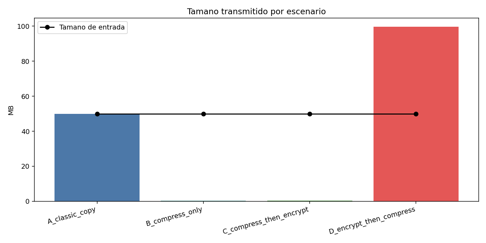
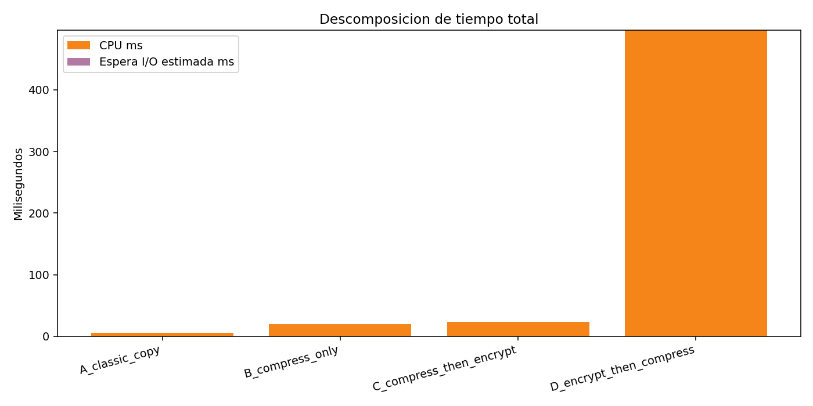
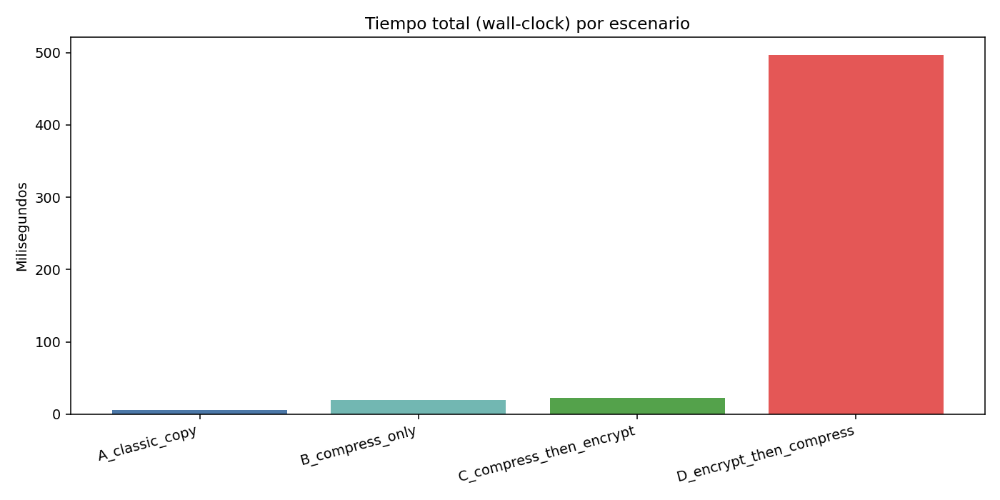

# Reto Final - Triangulo de Hierro (Espacio, Tiempo y Seguridad)

Proyecto para la clase **Sistemas Operativos - C2661-SI2004-5186**  
Profesor: **Edison Valencia**  
Desarrolladores: **Maximiliano Bustamante** y **Valeria Hornung**

Este repositorio implementa en C un pipeline de transformaciones en memoria RAM para archivos:

- Escenario A: copia clasica (sin transformacion).
- Escenario B: solo compresion.
- Escenario C: compresion y luego encriptacion (`compress -> encrypt`).
- Escenario D: encriptacion y luego compresion (`encrypt -> compress`).

Tambien incluye benchmark automatizado y graficas comparativas para justificar el orden correcto del pipeline.

## Arquitectura implementada

Archivo principal: `src/pipeline.c`

- **Compresion:** RLE en memoria (`rle_compress` y `rle_decompress`).
- **Encriptacion simetrica:** XTEA-CBC con padding PKCS#7 (`xtea_cbc_encrypt` y `xtea_cbc_decrypt`).
- **Seguridad de llave:**
  - La llave se pide por consola o variable de entorno `PIPELINE_KEY` (no por `argv`).
  - Se bloquea memoria con `VirtualLock` (Windows) o `mlock` (POSIX) cuando es posible.
  - Se destruye en RAM con borrado seguro (`secure_zero`) inmediatamente despues de derivar la llave.
- **Buffers unificados en RAM:** las transformaciones se encadenan sin escribir a disco intermedio.

## Requisitos

- GCC disponible en PATH.
- Python 3.
- Libreria `matplotlib` para graficas:

```bash
pip install matplotlib
```

## Ejecucion rapida

1. Generar archivo de prueba de 50 MB:

```bash
python scripts/generate_data.py
```

2. Ejecutar benchmark (5 corridas por escenario):

```bash
python scripts/benchmark.py
```

3. Generar graficas:

```bash
python scripts/plot_results.py
```

## Artefactos generados

- Metricas CSV: `docs/metrics.csv`
- Graficas:
  - `docs/grafica_tamano.png`
  - `docs/grafica_tiempos.png`
  - `docs/grafica_wall.png`
- Archivos de salida de pruebas: `out/`

## Conclusiones resumidas (dataset de 50 MB)

Valores promedio actuales en `docs/metrics.csv`:

- `A_classic_copy`: salida 50.00 MB, wall ~5.65 ms.
- `B_compress_only`: salida ~0.43 MB, wall ~19.39 ms.
- `C_compress_then_encrypt`: salida ~0.43 MB, wall ~22.99 ms.
- `D_encrypt_then_compress`: salida ~99.61 MB, wall ~496.42 ms.

Interpretacion:

- `compress -> encrypt` conserva casi toda la reduccion de tamano (`99.13%` frente a clasico).
- `encrypt -> compress` falla por entropia alta: casi duplica el tamano (`+99.22%`) y eleva drasticamente el tiempo total.

## Graficas de resultados

### Tamano por escenario



### Descomposicion de tiempo (CPU / espera I-O estimada)



### Tiempo total (wall-clock)



La justificacion completa esta en `justificacion.md`.
